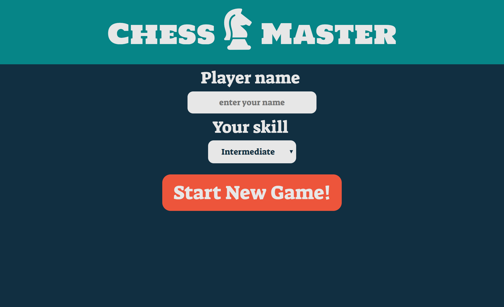
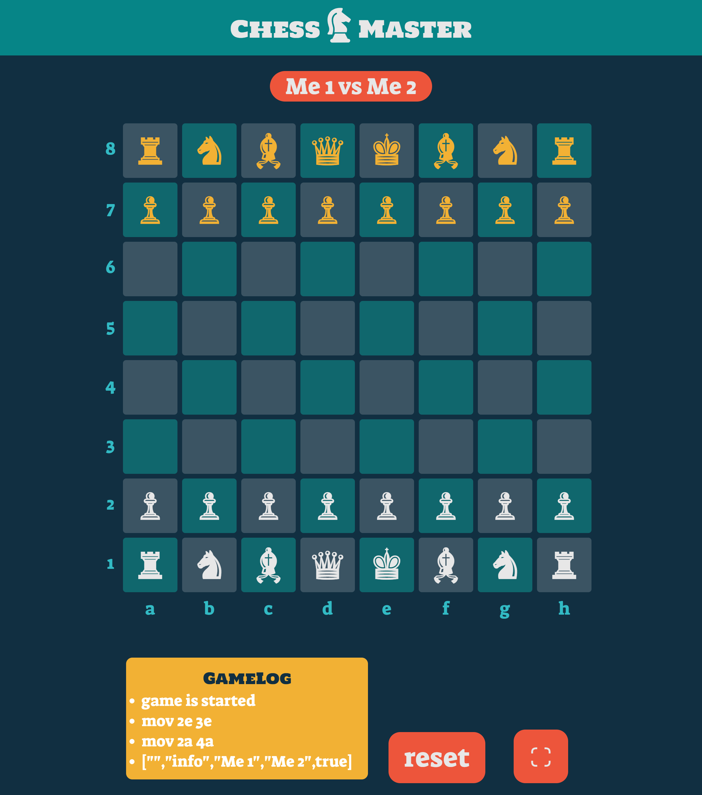
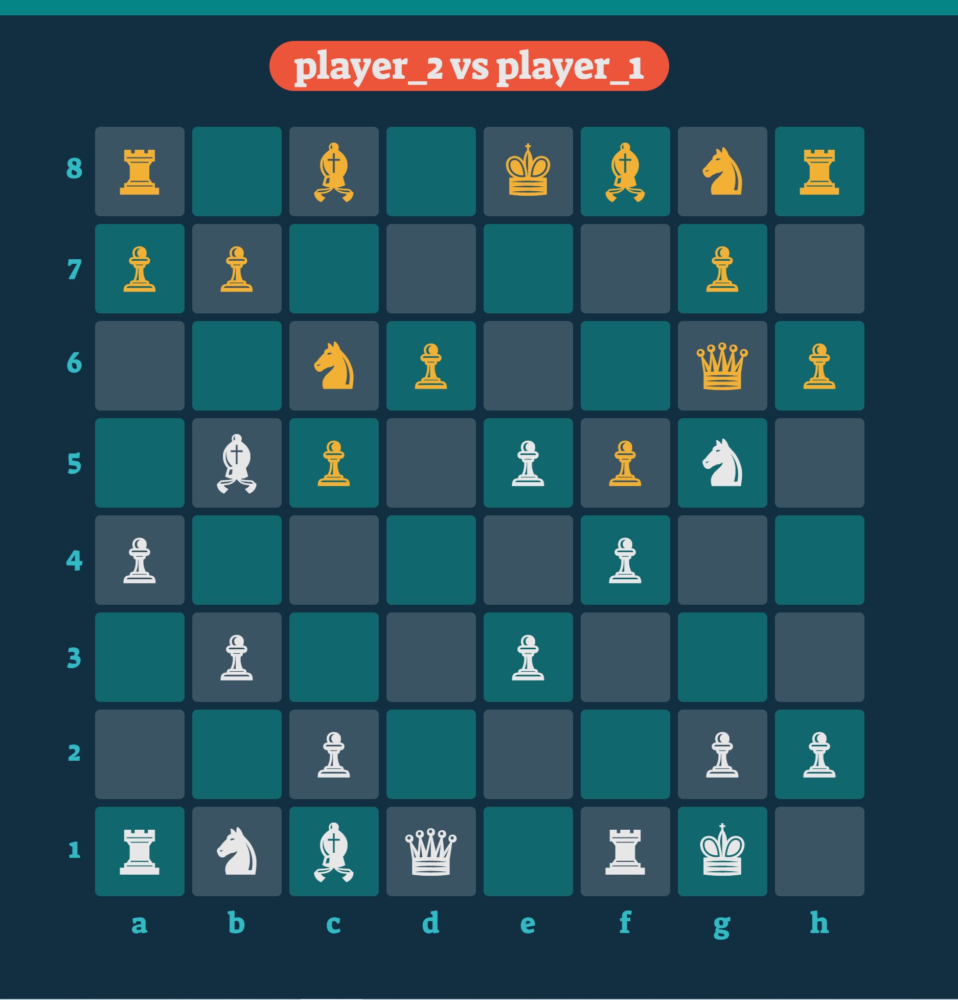

# ChessMaster
Two player standard chess game. Done as part of a uni assignment. It is done in just two weeks (the first one for learning JS), so don't expect too much 😅

## How to start the game?
1. From the terminal, `cd` to the game folder (the folder of the repo) and run `npm start [PORT_NUMBER]`
2. Enjoy the game at `http://localhost:[PORT_NUMBER]`
* This game benefits from browser-cookies to identify each player; so in order to mimic 2 player case, you need to open it on two different browsers (or diffrent same browser but diffrent users)

## Screenshots!

